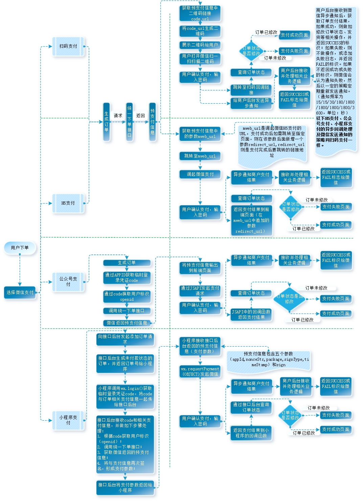

## 微信支付测试

---
### 一、概况
1. 扫码支付
商户在pc端展示一个支付二维码，用户使用微信扫一扫功能，扫码后实现付款的支付方式。
2. 公众号支付
商户在微信APP内（微信浏览器）打开H5网页，通过微信支付实现付款的支付方式。
3. H5支付
商户在微信浏览器以外的手机浏览器打开H5网页，通过微信支付实现付款的支付方式。
4. 小程序支付
商户在小程序内，通过微信支付实现付款功能的支付方式。

---

扫码支付、公众号支付、H5支付、小程序支付都有一个同步回调地址跟异步通知地址，只是设置方式有所区别：
1. 扫码支付
同步回调地址在微信商户平台中设置，异步通知地址在统一下单接口的请求参数中设置；
2. 公众号支付
同步回调地址在JSAPI发起支付的回到函数中进行回到，异步通知地址在统一下单接口的请求参数中设置；
3. H5支付
同步回调地址：在统一下单接口的返回参数中有一个参数mweb_url，在mweb_url中以get传参形式新增一个参数redirect_url，redirect_url即是同步回调函数；
异步通知地址：统一下单接口的请求参数中设置；
4. 小程序支付
同步回调地址：在小程序获得支付参数，并通过js调起微信支付以后，js中会有一个回调函数，同步回调地址在该回调函数中添加；
异步通知地址：统一下单接口的请求参数中设置。

---
1.同步回调地址是作为微信后台跟商户进行页面跳转的渠道，因此同步回调地址是至关重要的，如果不填写，则可能导致支付完成后无法做页面跳转。

2.异步通知地址是微信后台对商户后台在完成微信支付后进行通知的重要通道，商户后台的异步通知地址必须是可访问的，在接收到微信的通知后，要做相关业务处理，并最终返回SUCCESS或FAIL的标识给微信，以告知微信不要在发送通知。

